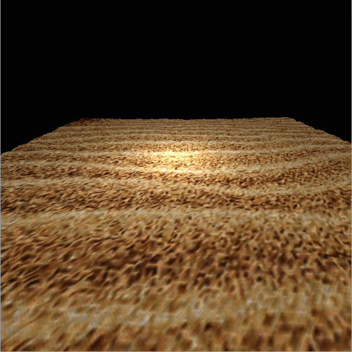
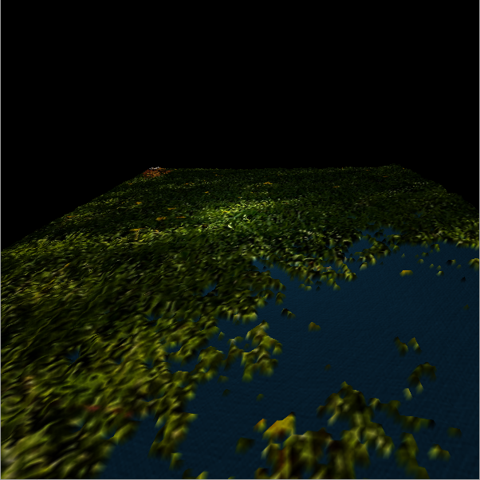
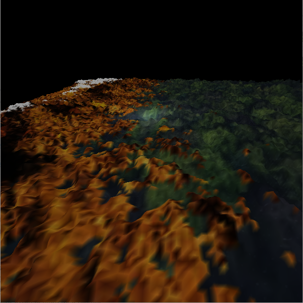
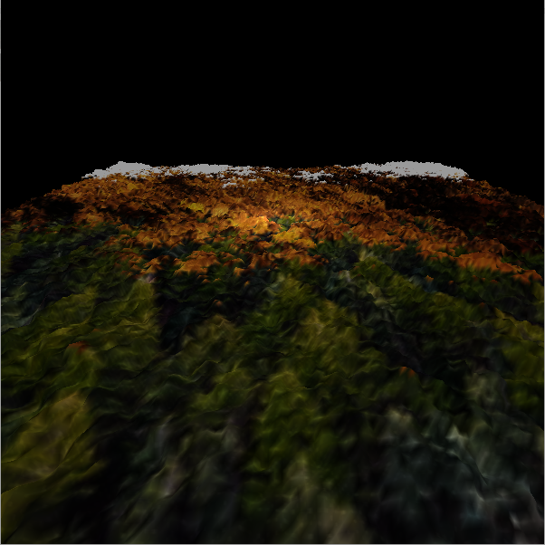
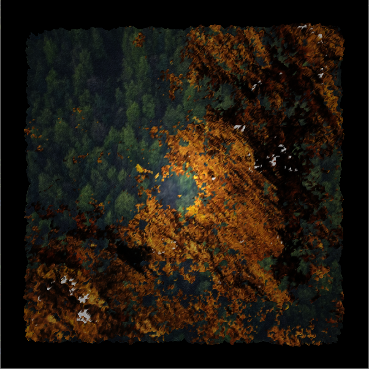
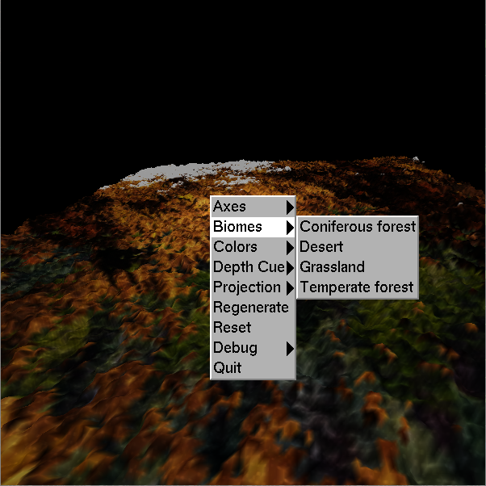

# Procedural Terrain Generator

The Terrain Generator procedurally generates random terrain and renders it in 3D using OpenGL. The terrain is one of several different biomes:

* desert
* grassland
* temperate forest
* coniferous forest

Only one biome is active at a time, and the user can change the biome in the menu. There is also a regenerate button to generate a new landscape without changing the biome. Each biome has specific data used in generating the terrain as well as a texture associated with it. Additionally, all of the biomes use the mountain texture.

|Desert Biome|Grassland Biome|
| ------------- | ------------- |
|   |   |

|Temperate Forest Biome|Coniferous Forest Biome|
| ------------- | ------------- |
|   |   |

## Terrain Generation

The [Diamond-square algorithm](https://en.wikipedia.org/wiki/Diamond-square_algorithm) is used to generate a 28 + 1 = 257 square array of heights. To fill out the array, first, the four corners are set to random values. Then, for the diamond step, the midpoint of the four corners is calculated by taking their average and adding a random value of at most `max_var`, a variable whose value depends on the currently active biome. Then, for the square step, the midpoint of the triangle formed by the middle point and two corner points is calculated by taking the average of those three points and the closest point found by wrapping around the other side of the array and then adding a random value. In both steps, the random value is multiplied by 2-_h_, where _h_ is a value from 0.0 to 1.0 that is dependent on the currently active biome. Since lower values produce rougher terrain, the forest terrains have _h_ values around 0.6, and the desert and grassland terrains have _h_ values between 0.8 and 1.0. The diamond step and the square step are repeated until the entire array is filled with values.

The data from the array is written to a texture that is used in the vertex shader to determine the vertical displacement (height) at each point on the map. The fragment shader also uses this data to calculate normals for lighting.

The vertex shader also controls which color or texture is used in each part of the terrain. The ratio of the elevation of each vertex to the maximum elevation in the current terrain determines how the vertex should be colored. There are three cutoff points: one for water, one for land, and one for mountain. Vertices below the first cutoff point are colored blue to represent water. Vertices between the first and second cutoff points are colored with a texture specific to the current biome. Vertices between the second and third cutoff points are colored with the mountain texture. Vertices above the third cutoff point are colored white to represent snow on the top of the mountain. Each terrain has its own set of cutoff points.

## Modes

The user can toggle between `MAP` mode, where the terrain is viewed from above, and `EXPLORE` mode, where the terrain is viewed as if the user is standing on it. In `MAP` mode, the user can zoom in and out and move north, east, south, or west. In `EXPLORE` mode, the user can move left, right, forward, and backward.

## Usage

Building:

        $ make

Running:

        $ ./terrain_generator

### Controls

#### Mouse

<dl>
<dt>Scroll wheel</dt>
<dd>zoom in/zoom out (`MAP` mode only)</dd>
<dt>Right click</dt>
<dd>view menu</dd>
</dl>

#### Keyboard

<dl>
<dt><kbd>a</kbd></dt>
<dd>move left (`EXPLORE` mode) or west (`MAP` mode)</dd>
<dt><kbd>d</kbd></dt>
<dd>move right (`EXPLORE` mode) or east (`MAP` mode)</dd>
<dt><kbd>o</kbd></dt>
<dd>view orthographic projection</dd>
<dt><kbd>p</kbd></dt>
<dd>view perspective projection</dd>
<dt><kbd>q</kbd></dt>
<dd>quit the program</dd>
<dt><kbd>r</kbd></dt>
<dd>regenerate terrain</dd>
<dt><kbd>s</kbd></dt>
<dd>move backward (`EXPLORE` mode) or south (`MAP` mode)</dd>
<dt><kbd>w</kbd></dt>
<dd>move forward (`EXPLORE` mode) or north (`MAP` mode)</dd>
<dt><kbd>x</kbd></dt>
<dd>zoom in (`MAP` mode only)</dd>
<dt><kbd>z</kbd></dt>
<dd>zoom out (`MAP` mode only)</dd>
</dl>

## Known Issues

